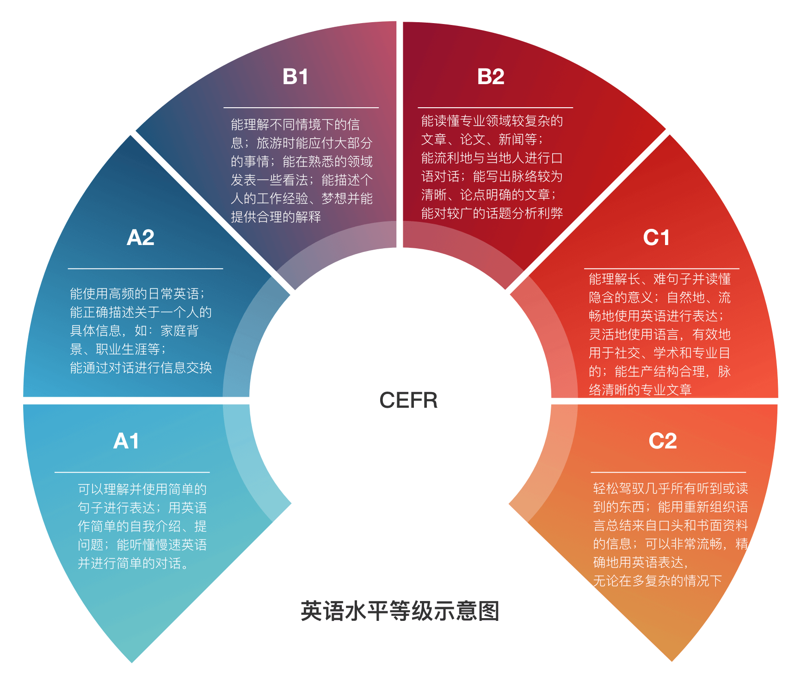

# English-level-up-tips-for-Chinese

英语作为一门语言，学习起来应该是一件比较自然而然的事情，就像我们自然而然地学会汉语那样。

在这份指南里，我会尽可能地综合我主观的看法与一定的科学依据，为大家提供一份详尽的英语进阶指南，真心希望本指南能给你带来一点小小的帮助。

*本图主要参考自 [CERF levels](http://www.coe.int/en/web/common-european-framework-reference-languages/table-1-cefr-3.3-common-reference-levels-global-scale)*
